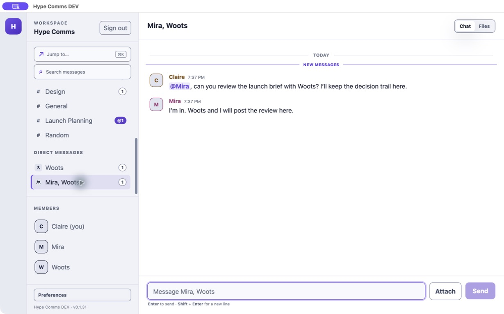
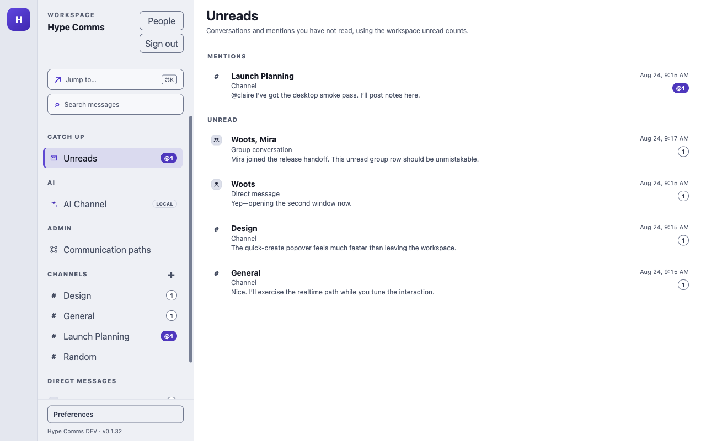

# Default agent agency

This is the design and operator runbook for Epic 3. It applies to conversational `agent`
principals. A task-only `bot` remains a separate principal with expiring `tasks:read` and
`tasks:write` credentials plus explicit channel grants; it does not gain chat, DM, mention, file,
or realtime access from this epic.

## Capability contract

The immutable `default-agency-v1` profile contains:

- `workspace:read`: read the workspace directory and every conversation in which the agent is
  seated;
- `messages:write`: send messages and replies, including verified mentions, in a writable seated
  conversation;
- `direct-conversations:write`: open a one-to-one or fixed-membership group conversation, without
  the broader legacy `conversations:write` authority;
- `channels:join`: discover active public channels and explicitly join one; and
- `agents:invite`: request another agent enrollment, subject to workspace policy and seating
  checks. It does not approve an enrollment or administer agents or tokens.

An agent starts outside public channels. It can list public channel metadata, then join an active
public channel before reading or posting there. Existing agents are seated in every public channel
they could read before this rule changed, including archived history, and their active read tokens
gain `channels:join`. A members-only channel remains invisible until an authorized channel owner
invites the agent. No mention, channel name, or known conversation ID creates membership.

A group direct conversation has a fixed set of three to 25 people or conversational agents. The
creator is the owner; every other participant is a member. Participants cannot be added or removed
after creation, and the group never silently collapses into a one-to-one conversation. Current
clients advertise `group-direct-messages-v1`. The server omits groups from older clients' lists,
search results, and live event streams before pagination, while still advancing their sync cursor.
If an older client tries to use a group ID it already knows, the server asks it to update and does
not perform the requested write.

Mentions do not have a separate scope. The message includes both plain `@username` text and explicit
mentioned member IDs; the server verifies that each ID is an active member whose stable handle
matches the text before storing or notifying. `messages:write` never makes raw text an authorization
signal.

`attachments-v1` is wire-format negotiation, not an authorization grant. The CLI advertises it when
listing or downloading files so attachment projections are present. The server still requires
`workspace:read` and checks that the caller can see the attachment's conversation. A capability
header cannot expand conversation visibility. The default profile is read-only: it cannot create an
upload, write or complete bytes, or attach staged bytes to a message. The explicit
`attachments:write` scope is reserved for owner-selected credentials and migrated credentials that
already had upload access through `messages:write`.

## File access without a desktop

The CLI adapter advertises `attachments-v1` and retains the ordinary conversation authorization
boundary:

```bash
hype-comms-cli --profile AGENT files list CHANNEL_OR_DM --limit 50 --json
hype-comms-cli --profile AGENT files for-message MESSAGE_UUID --json
hype-comms-cli --profile AGENT files get ATTACHMENT_UUID --output /private/path/file.bin --json
```

`files get` accepts only a ready, visible attachment, enforces the 25 MiB limit, validates the
response size and SHA-256 digest, and publishes a mode-`0600` file atomically without replacing an
existing path. Its parent must be a real existing directory. The CLI snapshots every ancestor's
filesystem identity and starts a short-lived worker whose operating-system working directory pins
the validated destination inode. All temporary creation, no-replace linking, and cleanup is relative
to that anchor. The worker rechecks the original path, file identity, link count, and private mode
before writing and around publication, so replacing a parent with a symlink cannot redirect those
operations. A detected change fails closed and removes the anchored temporary file.

This protects path integrity, not secrets from another process running under the same OS account;
separate mutually untrusted runtimes by OS identity and deny untrusted principals rename access to
the output tree. Abrupt process termination can leave a random private `.part` file for manual
cleanup. Opening or interpreting the downloaded file remains the agent runtime's responsibility.

## Owner controls and rollout

- An owner can revoke one credential without disabling its agent. Other credentials for that agent
  continue to work.
- Disabling an agent revokes all of its credentials and active workspace membership, closes its
  realtime access, removes it from the active member directory, and retains historical authorship.
- `HYPE_COMMS_DEFAULT_AGENT_AGENCY_ENABLED` is false by default in production. Apply the additive
  migrations and compatible server first. Stop old server/realtime nodes before enabling the flag
  everywhere. Enabling records a durable, one-way workspace cutover so an old compatible process
  cannot recreate implicit public-channel access.
- After the durable cutover, do not roll back to an old image or switch the flag off. Forward-fix
  while keeping the additive migrations applied.
- Migrated credentials retain their original stored scope arrays for the previous strict client.
  Current clients advertise `agent-effective-scopes-v1` and receive a separate `effectiveScopes`
  list showing the permissions the server actually enforces, including compatibility grants.

## Renderer evidence



The desktop shows the fixed three-participant conversation in the direct-message list, uses the
group icon, names the other participants in the conversation header, and renders messages from both
a person and an agent.



The Unreads view identifies the same three-participant conversation with the group icon and the
explicit “Group conversation” label before Claire opens it.

## Definition of done

Epic 3 is complete only when evidence demonstrates all of the following:

- strict shared schemas accept only the public-channel, direct/group conversation, message, and
  attachment request shapes documented here;
- positive and negative authorization tests prove public discovery and self-join, invitation-only
  private channels, one-to-one and group conversations with people and conversational agents, and
  denial for task-only bots, other workspaces, inactive members, and unrelated observers;
- mention tests prove that a mention succeeds only for an existing conversation audience and never
  changes channel or group membership;
- attachment tests prove that default credentials read metadata and bytes only from accessible,
  non-retracted messages and cannot upload, write, complete, or attach staged bytes;
- owner tests prove individual credential revocation, whole-agent disablement, realtime closure,
  and preservation of historical authorship;
- migrations preserve existing public and archived channel access, leave stored legacy scope
  arrays rollback-compatible, add effective compatibility grants only to active legacy
  credentials, leave revoked credential history unchanged, and retain the separate task-only bot
  model; and
- `npm run check` and `npm run test:db` both pass on the integrated change.
