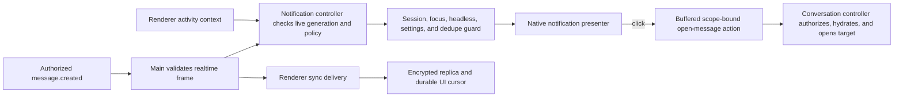

# Native notifications roadmap

Status: implementation Milestones 0 through 3 are complete. Deterministic suites cover the DM,
verified-mention, and participated-thread reasons; replica-first macOS window recreation; strict
click-through; preferences; and headless capture. The signed/notarized macOS release artifact now
includes the controller behind its default-off device preference; Windows and Linux release
artifacts remain compiled off. Milestone 4 remains open and is evaluated per platform, so one
platform can complete its pilot without waiting for the others. One signed/notarized macOS ARM64
run now proves installed synthetic toast delivery and click restoration; it is the first slice of
the required native matrix, not completion of the macOS gate.
[architecture.md](architecture.md) and [ADR 0002](adr/0002-native-notification-boundary.md) are the
implementation and security contract. This roadmap sequences the remaining proof and rollout work
and does not override those documents.

Tracking issue: [#42](https://github.com/hype-comms/hype-comms/issues/42) remains open
for Milestone 4 evidence and the eventual default decision.

## Outcome

Hype Comms should reliably get a person's attention for a high-signal message while the desktop
process is running in the background, without leaking message content, repeating replayed events,
or creating a second source of truth for unread state. On macOS, where the process remains running
after its last window closes, this includes recreating the window after a notification click.
Windows and Linux initially cover a background or minimized window; closing the last window keeps
its existing quit behavior.

The initial DM/mention slice is successful when all of the following are true:

- a direct message or server-verified mention delivered after the current realtime connection
  becomes live produces one native notification on each eligible running device;
- self-authored, duplicate, startup, HTTP catch-up, and realtime replay events never produce a
  notification;
- a focused app and a message already visible at the live tail of its Chat stream are quiet;
- notification content defaults to author and conversation metadata, never the message body;
- clicking a notification restores Hype Comms and opens the exact conversation and message or
  thread without crossing a stale sign-in boundary; and
- unsupported or denied operating-system notification capability is a stable state, not a retry
  or prompt loop.

This closes the background attention loop. It does not replace the existing read cursor, unread
count, mention count, sync cursor, or encrypted replica.

## Current position

The default-off notification implementation now includes:

- generation- and scope-safe realtime delivery, fail-closed invalid-frame handling, and
  membership-revocation repair before durable renderer acknowledgement;
- a main-process notification controller with the `system.connected` freshness boundary,
  body-free metadata projection, bounded deduplication/action/native-handle state, and stable
  local capability failure;
- strict notification preference, state, activity, readiness, action, and headless-activation
  schemas with sender and byte-bound checks in main and preload;
- device-local atomic preferences, separate support and OS-permission state, and renderer settings;
- exact, scope-bound `open-message` navigation with authorized by-ID hydration and a
  renderer-initiated ready/drain handshake plus exact post-navigation acknowledgement;
- an unpackaged headless capture presenter that records only an opaque capture ID and eligibility
  reason, then exercises the normal click path through a headless-only activation bridge;
- a capability-gated, recipient-specific participated-thread reason frozen by the server and
  consumed after verified-mention and direct-message precedence;
- macOS windowless notification observation separated from renderer delivery, followed by
  replica-first HTTP catch-up and a fresh realtime epoch when a window is recreated; and
- Windows AppUserModelID configuration matching the packaged application ID before the first
  `BrowserWindow` is created.

This is not a completed cross-platform rollout. `HYPE_COMMS_NATIVE_NOTIFICATIONS_ENABLED` is a
build-time switch: unset or `0` compiles presentation off and `1` includes the controller. The macOS
release job sets `1` for an opt-in pilot; Windows and Linux release jobs set `0`. Even in an enabled
build, the persisted device preference defaults to disabled and body preview defaults off. Ordinary
demos clear the switch; the isolated headless demo pins it on and selects capture, never the Electron
native presenter.

In a flag-enabled macOS build, closing the last window keeps only notification observation alive;
it does not deliver or buffer renderer events or advance the renderer-owned cursor. A recreated
renderer catches up from its encrypted replica cursor before an authoritative snapshot, final HTTP
sync, and a new realtime epoch. Default-off macOS builds retain the conservative realtime-stop
fallback. Windows and Linux retain last-window stop-and-quit behavior.

The remaining per-platform gates cover installed native behavior on current and previous supported
macOS on arm64/x64, Windows 11 on x64/ARM64, and Ubuntu 24.04 on x64/ARM64 installed from both
AppImage and Debian packages. One signed/notarized macOS ARM64 synthetic toast/click run passes;
ordinary package smoke and headless screenshots do not satisfy the rest of those gates. Passing or
piloting one platform does not change another platform's release flag.

## Product policy

### Initial eligibility

One message produces at most one notification per running device. When several reasons apply, use
the first matching reason in this order: verified mention, direct message, participated-thread
reply. Scope, freshness, self, focus, visibility, capability, and duplicate suppression always
override reason precedence.

| Event or state | Initial behavior |
| --- | --- |
| Incoming message in a direct conversation | Notify |
| Incoming message that explicitly mentions the signed-in user | Notify |
| Reply carrying the server's recipient-specific participated-thread reason | Notify |
| Ordinary channel message without a verified mention | Do not notify |
| Reaction, task, membership, read-cursor, or system event | Do not notify |
| Message authored by the signed-in user | Suppress |
| Message whose author ID is null | Suppress |
| App window focused | Suppress |
| Target message stream is visible at its live tail in Chat | Suppress |
| Target conversation is selected but scrolled away from its tail | Notify if otherwise eligible |
| Target conversation is selected while another pane is shown | Notify if otherwise eligible |
| Startup bootstrap, HTTP catch-up, or realtime pre-live replay | Suppress |
| Event ID/sequence already handled in this notification session | Suppress |
| Signed out, replacing session, unsupported, or disabled | Suppress |
| Headless automation | Capture eligible outcome; never emit a native toast |
| Human- or agent-authored message satisfying the same eligibility | Treat identically |

"Incoming direct message" means each fresh incoming message in a direct conversation, not only
creation of the conversation. A DM that also contains a mention still produces only one
notification.

"Currently visible" is an event-time snapshot: a non-minimized, shown window whose latest
validated renderer activity reports the Chat pane, the target conversation or thread, and that the
applicable message stream is at its live tail, so the incoming message will render in the viewport.
Merely selecting a conversation while scrolled into history does not make a new message visible.
Main suppresses all notifications when the window is focused. A hidden or minimized window is not
visible; Electron cannot reliably detect whether another application's window merely obscures Hype
Comms. Unknown or stale activity context is treated as not visible, while focus, self, replay, and
scope suppression still apply.

### Freshness and replay

Realtime is at-least-once, and the desktop process can outlive its window. Native notification
delivery therefore belongs to a main-process controller with an ephemeral, session-bound handled
watermark. That watermark is only notification bookkeeping: it must never advance the renderer's
durable sync cursor, read cursor, unread count, or encrypted replica.

For the initial slice, the `system.connected` event is the freshness boundary:

- seed the controller from the authoritative bootstrap cursor before realtime starts;
- events replayed before `system.connected` may repair the replica but do not notify;
- HTTP sync and authoritative rebuilds never notify;
- a validated, scope-matching `system.connected` raises the notification watermark to its
  `workspaceSequence`, then arms only the identified `connectionId`;
- `offline`, `reconnecting`, and a new socket disarm eligibility without clearing the signed-in
  scope's watermark; only that socket's `system.connected` arms it again;
- only a strictly validated `message.created` event delivered by that armed connection may be
  evaluated; and
- event ID plus workspace sequence deduplication keeps reconnect replay quiet even when the process
  stayed open during the gap.

This deliberately favors calm, duplicate-free behavior over alerting for a message that arrived
during a disconnect. A later catch-up summary may cover that gap, but replaying one toast per event
is not an acceptable fallback.

The implemented flag-enabled macOS transport keeps a distinct notification-observer path alive
without a renderer. It never emits renderer IPC, buffers no UI frames, and cannot advance or
acknowledge the renderer-owned durable cursor. Window creation does not make `did-finish-load` a
delivery boundary. The renderer first completes `/sync` from the encrypted replica cursor, commits
the authoritative snapshot, completes final HTTP catch-up, and then opens a new realtime epoch from
that durable cursor. A retryable catch-up attaches no realtime connection until it succeeds.

A windowless `system.resync_required` closes and latches body-free recovery rather than reconnecting
forever from a cursor the server rejected. The recreated renderer receives that control, performs
authoritative recovery, and only a strictly newer durable cursor consumes the latch and restarts
once. The deterministic [main transport](../apps/desktop/src/main/workspace-realtime.test.ts) and
[renderer recovery](../apps/desktop/src/renderer/src/workspace-runtime.test.ts) suites prove that
windowless observation cannot become UI acknowledgement or cross into a recreated-but-not-ready
renderer. Default-off macOS builds retain last-window realtime stop; Windows and Linux retain
last-window stop-and-quit behavior.

The transport also bounds replay held before `system.connected` to 1,024 events and 4 MiB.
Overflow closes the socket, drops the message-bearing buffer, and retains only a scope-bound,
body-free recovery control. A subscribed renderer receives that control through its explicit
realtime-start handshake; the socket remains stopped until authoritative HTTP recovery supplies a
strictly newer durable cursor. Failed delivery and an ordinary renderer stop retain the control,
while sign-out, scope replacement, and shutdown purge it. An ordinary event that cannot cross the
current renderer boundary pauses the transport for durable catch-up instead of reconnecting or
claiming the event was applied.

### Privacy defaults

- Notifications are device-local and enabled only when the operating system supports them.
- Message-body preview is off by default. The notification shows bounded author and conversation
  labels only.
- A separate explicit device setting may enable a body preview sourced from the canonical event; raw
  renderer-provided body text must not become a generic main-process notification capability.
- Notification bodies, message bodies, author labels, conversation labels, and target IDs must not
  be written to production logs or metrics.
- Server-side notification analytics containing user, workspace, conversation, message, author, or
  body data are prohibited, not a deferred feature.
- The operating system owns sound and do-not-disturb behavior. Hype Comms adds no custom sound in
  the initial slice.

### Action behavior

The action must be scope-bound, body-free, and exact:

```ts
interface NotificationAction {
  readonly version: 1;
  readonly type: "open-message";
  readonly sessionGeneration: number;
  readonly userId: string;
  readonly workspaceId: string;
  readonly conversationId: string;
  readonly messageId: string;
  readonly threadRootId: string | null;
}
```

Clicking restores and focuses the main window, selects the conversation, opens the thread when
needed, and focuses/highlights the message. On macOS it recreates the main window first when the
process is running without one. If the exact message cannot be restored, fall back to the
authorized conversation with a non-sensitive in-app explanation. If the user signed out, changed
scope, or lost access, discard the action instead of opening stale data.

Main derives every target ID from the retained canonical event; the renderer cannot supply an
unrelated target. After workspace catch-up and current-scope authorization, the conversation
controller resolves the message from the replica. If it is absent, a strict authorized by-ID
hydration operation fetches it before anything is rendered. This replaces, rather than silently
reinterprets, the architecture's absent-cache fetch requirement; the resulting message can then
reuse the existing search-result navigation behavior. Pending actions remain memory-only and bound
to the exact session generation, user, and workspace. They must not contain, log, or persist the
message body.

Action delivery uses a renderer-initiated drain after the subscription and workspace session are
ready. `did-finish-load` alone is not a sufficient readiness signal. Drain and push delivery are
at-least-once: main retains each action until the exact sender, scope, session generation, and
renderer generation acknowledge it after navigation handling. Renderer-side bounded deduplication
retries a failed acknowledgement without repeating navigation; a crash or reload re-drains every
unacknowledged action.

Click guarantees last only for the originating process lifetime. Main retains each live Electron
`Notification` object until click, close, failure, eviction, or shutdown, and closes every
outstanding native notification on sign-out, scope replacement, and shutdown. This prevents a
persisted operating-system toast from cold-activating a body-free action after its authorization
context has disappeared.

## Ownership and trust boundary

Electron main is the only layer that evaluates live notification eligibility and constructs a
native notification. The renderer reports bounded activity context and handles navigation; it does
not request arbitrary notification content.



The boundary has these responsibilities:

| Layer | Owns | Must not own |
| --- | --- | --- |
| Server/contracts | Message authorization, verified mention IDs, durable audience, capability-gated recipient thread reason | Device focus or OS notification state |
| Main realtime session | Strict frame validation, current user/workspace/generation, freshness boundary | Renderer read state or claiming notification handling is UI commit |
| Main notification | Pure policy, labels, ephemeral watermark, settings, focus/headless guard, presenter, queue | Parsing body text for mentions or exposing generic title/body IPC |
| Preload | Strict action/activity schemas, bounded ready/drain/ack bridge | Native presentation or persistent notification state |
| Renderer session | Current pane/conversation/thread activity and durable replica synchronization | Electron `Notification`, OS permission APIs, or notification dedupe |
| Conversation controller | Current-scope authorization, hydration, exact message/thread focus | Bypassing the replica or server authorization |

The notification controller retains only bounded current-session data: the bootstrap baseline,
live generation, handled event IDs/sequences, conversation/member labels, activity snapshot,
native notification handles, and pending click actions. Preserve the handled watermark across
recoverable disconnects and invalid-frame reconnects. Clear the whole scope only on definitive
sign-out, user/workspace replacement, and shutdown. A conversation-membership removal immediately
closes and purges that conversation's notifications and actions, blocks new ones, and stays blocked
until an authoritative catalog refresh confirms access. Thread participation does not belong in
this local cache; the server freezes and sends the capability-gated recipient-specific reason.

Notification evaluation and native presentation are outside the renderer sync acknowledgement
critical path. Failure, denial, or delay in the notification controller must never reject event
application, advance or hold the durable UI cursor, reconnect realtime, or cause an event to be
replayed for notification's sake.

Every validated event in the armed connection is consumed for notification purposes exactly once,
whether it is eligible, suppressed, unsupported, denied, or fails during presentation. The
controller advances its own watermark after the policy decision and presentation attempt, never as
a retry signal and never as a renderer acknowledgement.

Every notification IPC payload has a strict Zod schema, a size bound, trusted-sender validation
where the renderer invokes main, and tests in main and preload. The former handwritten action
validator has been replaced rather than extended.

### Resource and lifecycle bounds

- Keep one monotonic notification watermark and the most recent 1,024 event IDs for the signed-in
  scope. Evict event IDs oldest-first; never evict or lower the watermark.
- Before the user-bound `system.connected` handshake, buffer at most 1,024 validated replay events
  and 4 MiB of serialized frames, with a 4 MiB per-frame cap. Overflow must discard the
  message-bearing buffer, retain only a scope-bound body-free resync control, and wait for renderer
  HTTP recovery to provide a newer durable cursor instead of reconnecting from the overflowing
  cursor.
- Keep at most 32 clicked actions pending, including delivered but unacknowledged actions. Drop the
  oldest on overflow and record only a content-free diagnostic counter.
- Keep at most 128 live native notification handles. Close and evict the oldest on overflow; remove
  a handle immediately on click, close, or failure.
- Build the canonical label projection from bootstrap, all paginated conversation responses, the
  at-most-25-member directory, and ordered conversation/member invalidations. Cap it at the replica
  contract's 5,000 conversations; disable presentation and request authoritative repair rather
  than evicting an arbitrary authorized conversation.
- Bind activity context to both `webContents.id` and a renderer-session generation. Each update has
  a monotonic revision; reject older or equal revisions and invalidate the context on navigation,
  destruction, or session replacement. No wall-clock guess defines staleness.

## Delivery roadmap

Implementation Milestones 0 through 3 are complete and retained below as the accepted delivery
record. Milestone 4 is open and is the only remaining notification rollout/default gate.

### Milestone 0: lock the contract

Status: complete.

Goal: remove policy ambiguity before native side effects exist.

Deliverables:

- land generation-safe realtime, fail-closed invalid-event handling, and membership-revocation
  repair before enabling presentation;
- record the main/renderer split, windowless realtime contract, live-event freshness boundary,
  privacy default, and action scope in an ADR;
- define strict notification activity, state, preference, and action schemas;
- retain last-window realtime stop until the macOS windowless catch-up contract is proven, then
  allow only the separated observer path in explicit flag-enabled builds;
- define the exact focused/visible rule using renderer activity context plus authoritative
  `BrowserWindow` state;
- write the pure eligibility-policy test table before integration; and
- define separate device preference, native support, and OS permission fields. Electron 43 exposes
  portable native-support detection but no portable permission query, so permission can remain
  `unknown` where the host has no integrated adapter; packaged macOS uses an in-bundle native
  authorization adapter, with installed behavior proven in Milestone 4.

Completed exit evidence: all behavior in the Product policy section maps to an unambiguous test
case, and no schema exposes a generic title/body/action notification primitive to the renderer.

### Milestone 1: direct-message and mention vertical slice

Status: complete behind the default-off build and device settings.

Goal: implement and prove the smallest complete attention loop on the prerequisite session and
sync boundaries.

Deliverables:

- add an injectable main-process notification presenter; production uses Electron and tests use a
  fake presenter;
- add a main-process controller that arms at the validated `system.connected` boundary and owns
  only an ephemeral handled watermark plus a bounded canonical metadata projection built from
  authorized bootstrap, every conversation page, and directory responses;
- replace the channel-only action and unscoped queue with a bounded, session-bound exact target;
- replace eager `did-finish-load` action flushing with a renderer-ready pull and exact
  acknowledgement so early clicks and renderer crashes cannot lose an action;
- classify replay versus live events around `system.connected` in the main realtime generation;
- disarm on connection transition, preserve the scope watermark, and re-arm only for the matching
  new `connectionId`;
- keep notification handling separate from the renderer's durable event acknowledgement, and prove
  window recreation catches the replica up before live UI delivery resumes;
- support direct-message and verified-mention reasons with one-notification precedence;
- prove that mention-like body text without the server-verified user ID is not eligible;
- suppress self, focus, visible live-tail, duplicate, stale generation, disabled, and unsupported
  cases while preserving scrolled-away alerts;
- select a capture/no-op presenter for headless clients before any native presenter is constructed;
  store body-free records in the existing private headless artifact directory and activate clicks
  through an opaque captured ID rather than by editing the artifact;
- recreate the window on macOS when needed, otherwise restore/focus it, then reauthorize and open
  or fetch the exact message target on click;
- add the strict authorized by-ID hydration contract and transport needed when that target is absent
  from the replica, without revealing whether an unauthorized message exists;
- retain and clean up live native notification objects deterministically; and
- default to metadata-only notification content.

The Milestone 1 implementation remains behind the default-off build switch described in
[operations.md](operations.md). Its deterministic and headless interaction gates pass, including
replica-first macOS window recreation. The device preference stays disabled by default even in an
opted-in build, and installed native behavior remains a Milestone 4 gate.

Completed evidence: the isolated two-client headless flow proves DM/mention capture and exact
click-through without a real OS toast. Deterministic policy, main, and renderer suites prove every
suppression path, reconnect replay quieting, no UI history loss across a macOS windowless interval,
Windows/Linux last-window shutdown, and sign-out action invalidation.

### Milestone 2: preferences and operating-system state

Status: complete behind the same defaults. Packaged macOS requests authorization through the real
signed app identity before persisting enablement; installed behavior remains Milestone 4 evidence.

Goal: make the feature respectful and diagnosable without building a general settings system.

Deliverables:

- persist a versioned, atomic, device-local enabled preference and content-preview preference in
  Electron main;
- expose device preference (`enabled` or `disabled`), native support (`supported` or `unsupported`),
  and OS permission (`granted`, `denied`, or `unknown`) as separate fields through the frozen
  preload API;
- add a compact renderer setting with clear copy for OS-managed denial and do-not-disturb behavior;
- on packaged macOS, request authorization from the signed Hype Comms bundle when a person enables
  notifications, persist enablement only after a grant, and report denial without retrying; and
- never repeatedly prompt or retry after denial or presenter failure.

Completed deterministic exit evidence: relaunch preserves preferences, unsupported/denied state is
stable, preview content cannot appear without explicit opt-in, and the settings UI has screenshot
evidence. Installed denial behavior remains part of Milestone 4 where it is observable.

### Milestone 3: participated-thread replies

Status: complete behind the same default-off build and device settings.

Goal: add the architecture's third high-signal reason without guessing from a partial local cache.

The implemented rolling-compatible contract stores recipient eligibility outside the shared event
JSON, freezes it when the reply commits, and projects the optional
`recipientNotificationReason: "participated_thread_reply"` field only for a client that negotiated
`participated-thread-notifications-v1`. Legacy clients receive the strict legacy shape.

Deliverables:

- define participation as authoring the root or any reply; reserve deletion semantics for a later
  message-deletion contract;
- have the server freeze the eligible root author and prior repliers when the reply commits, exclude
  the reply author, intersect with the authorized event audience, and expose a recipient-specific
  reason rather than deriving it from only the locally hydrated thread;
- capability-gate the new event reason so old servers omit it and old desktops are never sent a
  strict payload they cannot parse;
- preserve strict old/new server and desktop compatibility through the capability and
  rolling-release gate;
- deduplicate a reply that also qualifies as a DM or mention; and
- route clicks to the thread and exact reply.

Completed deterministic evidence: cold-cache and recipient-audience tests agree on participation,
removed members receive nothing, previous/current clients remain compatible, and replay remains
quiet.

Evidence: the [strict wire-contract tests](../packages/contracts/test/contracts.test.ts),
[server recipient-freeze and revocation tests](../apps/server/test/workspace-repository.test.ts),
[capability route tests](../apps/server/test/workspace-routes.test.ts),
[desktop policy tests](../apps/desktop/src/main/notification-policy.test.ts), and
[controller exact-reply tests](../apps/desktop/src/main/notification-controller.test.ts) cover the
Milestone 3 boundary without local participation inference.

### Milestone 4: packaged rollout gate for each platform

Status: open. The opt-in workflow lane passed one signed/notarized macOS ARM64 synthetic toast/click
run on an unlocked self-hosted Mac. Its checked-in
[OS toast](screenshots/macos-native-notification-toast.png) and
[click restoration](screenshots/macos-native-notification-click-through.png) prove that installed
slice; the lane does not run the rest of the required native matrix.

Goal: prove the native behavior on the artifacts people actually install.

Deliverables:

- capture a real notification with synthetic identities/content plus its click-through result under
  `docs/screenshots/`; use an OS-level/manual capture for the native toast and renderer capture for
  the resulting target;
- exercise supported, denied where observable, disabled, focused, minimized, and click cases on
  each applicable platform matrix: current and previous supported macOS on arm64/x64, Windows 11
  on x64/ARM64, and Ubuntu 24.04 on x64/ARM64 installed from AppImage and Debian packages;
- include install, launch, logout, relaunch, offline restart, update teardown, and uninstall rather
  than treating a notification-only run as the architecture's Native E2E gate;
- treat the existing package smoke as a build/content prerequisite only; it does not launch an
  installed app and therefore is not notification behavior evidence;
- verify Windows application identity and Linux desktop integration are sufficient for stable
  attribution and click handling;
- verify notification teardown during update, sign-out, macOS window recreation, and app shutdown;
  verify minimized-window behavior on Windows/Linux; and
- document any platform-specific limitation in the user-facing setting and release notes.

Per-platform exit gate: the applicable feature-integration and native-E2E rows in
`docs/architecture.md` are satisfied for notifications before that platform leaves its opt-in
pilot or changes its device default. The roadmap completes when every supported platform passes.

## Verification matrix

Milestones 0 through 3 are covered by the
[pure policy](../apps/desktop/src/main/notification-policy.test.ts),
[main controller](../apps/desktop/src/main/notification-controller.test.ts),
[main realtime](../apps/desktop/src/main/workspace-realtime.test.ts),
[renderer replica/realtime](../apps/desktop/src/renderer/src/workspace-runtime.test.ts),
[IPC contract](../packages/contracts/test/contracts.test.ts),
[Windows identity](../apps/desktop/src/main/application-identity.test.ts), and
[headless interaction](../scripts/demo-headless-smoke.test.mjs) suites. The checked-in
[click-through](screenshots/native-notification-click-through.png),
[settings](screenshots/native-notification-settings.png), and
[bootstrap recovery](screenshots/native-notification-bootstrap-retry-recovered.png),
[participated-thread reply](screenshots/native-notification-participated-thread-reply.png), and
[mention precedence](screenshots/native-notification-participated-thread-mention-precedence.png)
captures are renderer/headless evidence only. The signed macOS ARM64
[toast](screenshots/macos-native-notification-toast.png) and
[restored-window](screenshots/macos-native-notification-click-through.png) captures prove one
packaged-native slice. The full packaged-native and OS-toast rows below remain open.

| Layer | Required evidence |
| --- | --- |
| Pure policy | Eligibility, precedence, self/focus/live-tail suppression, scrolled-away behavior, live boundary, duplicates, settings |
| Main controller | Baseline/watermark, fake presenter, exact capacity bounds, session invalidation, native lifecycle, content-safe errors |
| IPC/preload | Strict schemas, unknown/oversized rejection, sender checks, ready/drain/ack ordering, listener cleanup, frozen API |
| Renderer session/sync | Revisioned activity; macOS no-window catch-up; notification failure cannot advance or stall durable acknowledgement |
| Renderer navigation | Channel, DM, root, and reply targets; authorized absent-cache hydration; revoked/missing fallback |
| Two-client integration | DM, mention, replay/reconnect, macOS no-window catch-up, concurrent read, sign-out-before-click, agent-authored mention |
| Headless demo | Injected capture/no-op presenter; native presenter never constructed; opaque-ID policy and action proof |
| Packaged native | Full architecture matrix for display, suppression, capability, attribution, click, lifecycle, and cleanup |
| Visual evidence | Manual OS toast with synthetic content plus captured focused conversation/thread and settings states |

Tests must never depend on a developer's real notification permission or emit real toasts during
ordinary `npm run check` or the headless demo. Native presentation belongs only in explicit
packaged smoke/E2E lanes.

### Headless capture contract

`npm run demo:headless` creates an unpackaged, isolated client profile, compiles the notification
slice in, and supplies a private per-run artifact directory. Each client appends to
`notifications-<profile>.jsonl` with mode `0600`. The file contains at most 1,024 JSONL records,
and each record contains exactly `version`, an opaque `captureId`, and `reason`; it contains no
user, workspace, conversation, message, author, label, or body data. The artifact is observation
only and must not be edited to simulate a click. Headless automation passes the opaque ID through
the strict `activateCapturedNotification` bridge, which activates only a still-live in-memory
callback for that originating process. Unknown, expired, clicked, closed, or invalidated IDs do
nothing. Packaged and non-headless clients cannot use this bridge, and headless mode never
constructs the Electron native presenter.

The current isolated two-client proof exercises a fresh incoming DM, exactly one body-free
capture, opaque-ID activation through production main/preload IPC, and exact message highlighting.
Its renderer evidence is [notification click-through](screenshots/native-notification-click-through.png)
and [notification settings](screenshots/native-notification-settings.png). This is headless capture
evidence, not an operating-system toast or installed-platform Milestone 4 result.

A fault-injected two-client proof also rejects the first workspace bootstrap, shows the
[actionable unavailable state](screenshots/native-notification-bootstrap-retry-before.png), and
uses the visible Retry control to recover. The automatically restored notification binding then
captures a fresh DM and completes opaque-ID activation to the
[exact highlighted target](screenshots/native-notification-bootstrap-retry-recovered.png). The
recovering client observes exactly one failed and one forwarded bootstrap before the second client
starts; no manual context bind is used.

The deterministic suites also cover:

- selected-but-scrolled-away versus live-tail-visible messages, Chat versus Tasks, and the thread
  pane versus the main timeline;
- initial replay, reconnect replay, duplicate post-live delivery, connection-generation rollover,
  and malformed-frame shutdown;
- denied permission or presenter failure causing one attempt, no timer/reconnect retry, continued
  event processing, and recovery only after an explicit capability refresh;
- a unique canary body absent from native options, logs, metrics, action/capture artifacts, and
  screenshots while previews are off;
- capacity and capacity-plus-one behavior for event IDs, actions, native handles, and labels;
- out-of-order activity revisions, renderer reload/destruction, sign-out/re-sign-in, and
  conversation-membership removal before click;
- action and activity IPC rejecting malformed, oversized, unknown-field, stale-sender, and stale
  generation inputs, with listener teardown proven; and
- preference corruption, oversized files, concurrent writes, private file permissions, and
  development-profile isolation.

## Rollout and rollback

- Keep the feature device-local; the initial DM/mention slice adds no database migration, push
  token, hosted worker, or server-side delivery queue.
- Every Milestone 0 prerequisite is present. The macOS release artifact is the first opt-in pilot;
  Windows and Linux remain compiled off until their platform rollout begins.
- The enabled preference is present and still defaults disabled. A platform may include the
  controller to collect installed pilot evidence without waiting for other platforms; changing its
  device default still requires that platform's installed packaged gate.
- A rollback disables native presentation while preserving existing unread, mention, sync, cache,
  and outbox state. It must not require a server rollback.
- Treat presenter errors as local capability failures. They do not reconnect realtime, replay
  events, advance read cursors, or change server state.

## Deferred work

The following are intentionally outside the initial roadmap:

- push notifications while the desktop process is fully quit;
- changing Windows/Linux into resident background or tray applications after the last window closes;
- email, browser, or mobile notification delivery;
- ordinary channel-message alerts, topic follow/mute rules, and per-channel notification settings;
- catch-up summaries, batching, rate-based quieting, schedules, or custom do-not-disturb;
- dock/taskbar badges, tray unread state, custom sounds, inline reply, or notification action
  buttons;
- task, reaction, membership, update, or operational alert notifications.

Each deferred item requires an explicit product decision; none should emerge accidentally from the
native presenter or generic IPC.

## Completion gates

The implementation may now enter explicit installed native-evidence runs because Milestones 0
through 3 and their deterministic tests pass. The macOS release artifact supplies that opt-in
pilot; ordinary development, Windows, and Linux builds remain compiled off, and every platform's
device preference remains default-off until its applicable Milestone 4 evidence passes.

The contract, DM/mention/thread behavior, privacy defaults, scope invalidation, replay suppression,
and replica-first windowless recovery are implemented and proven deterministically. The
`ROADMAP.md` native-notifications item remains incomplete until:

- actual packaged interaction and screenshot evidence exists for every applicable platform slice;
- `npm run check`, `npm run test:db`, relevant package verification, and native smoke lanes pass;
- `ROADMAP.md`, `docs/architecture.md`, operations/release notes, and issue references agree; and
- the installed application—not a mocked renderer alone—has demonstrated display and exact
  click-through on every supported desktop platform, with each platform allowed to pass and ship
  independently.
