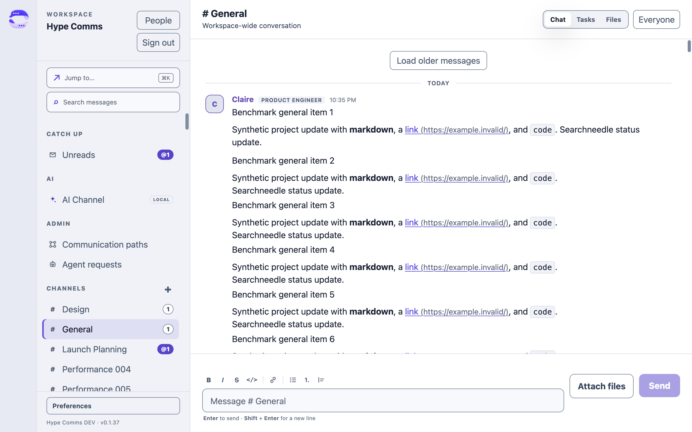

# Performance baseline, September 6, 2026 UTC

The first improvement target should be startup and realtime readiness. At 200 channels, a fresh
profile makes 613 HTTP requests and downloads roughly 6 MB of response bodies before the benchmark
reaches the content/live checkpoints. At 50 channels with a 40 ms delay before every HTTP handler,
fresh startup takes 9.34 seconds. The same workspace switches cached conversations in about 48 ms.

This baseline is for `codex/performance-baselines`, with application source at
`db8a7dd864ff0bc22ba08a9b5cc50e8a8da77d43`. This report measures the application before the performance changes. The later PR series adds the benchmark and implementation changes. These results describe this Mac and this synthetic workload;
they are not production telemetry or a packaged-release performance claim.

Original JSON files are in the [evidence archive](evidence-2026-09-06.tar.gz) under `docs/performance/`, with their original filenames and contents.

## Reference conditions and evidence

The host is an Apple A18 Pro Mac (Mac17,5), 8 GiB RAM, macOS 26.6.2, arm64. It used Node 24.18.0,
npm 11.16.0, PostgreSQL 17.11, Electron 43.4.0, and the repository's locked dependencies. The
production build configuration generates the desktop bundles; the app runs unpackaged with
`NODE_ENV=development`, a local renderer origin, and a hidden 1280×800 CSS-pixel window. The
benchmark server uses the real database, identity/workspace routes and realtime hub, with request
logging off and external services disabled. See the [methodology and repeat commands](README.md).

The four final runs each discard one startup and then measure three fresh profiles and three
restarts with saved session/cached data. Every repeated interaction discards one warmup and retains
20 samples. The raw files include all measurements and SHA-256 hashes of the benchmark scripts,
lockfile and desktop/server/contracts outputs. They record the application commit and uncommitted
worktree state, rather than implying that the benchmark exists in the base commit.

| Scenario       | Fixture                                                            | Raw result                                        |
| -------------- | ------------------------------------------------------------------ | ------------------------------------------------- |
| small          | 5 channels + 1 DM, 1,008 messages, 2 humans                        | [small.json](evidence-2026-09-06.tar.gz)          |
| medium         | 50 channels + 1 DM, 10,008 messages, 2 humans                      | [medium.json](evidence-2026-09-06.tar.gz)         |
| large          | 200 channels + 1 DM, 40,008 messages, 2 humans                     | [large.json](evidence-2026-09-06.tar.gz)          |
| medium-delay40 | 50 channels + 1 DM, 10,008 messages, 2 humans; +40 ms/HTTP request | [medium-delay40.json](evidence-2026-09-06.tar.gz) |

Each channel receives 200 additional short Markdown messages. Historical bulk inserts have no
historical event backlog. The latest 50 messages per channel enter the initial encrypted cache;
the whole database remains available to search and history paging. New timed sends go through the
real write path. Tasks, attachments and historical thread replies are empty in these fixtures.
All four final runs completed with persistent encryption and zero unexpected HTTP errors.

## Startup and data loaded

Times below are medians in milliseconds. Parentheses show the full range of the three starts,
not a statistical confidence interval. Content readiness requires General message rows and two
animation frames. Realtime readiness additionally requires the desktop's `live` state. The
second value matters: seeing cached text does not mean catch-up has finished.

| Measurement                             |         Small |              Medium |               Large |       Medium +40 ms |
| --------------------------------------- | ------------: | ------------------: | ------------------: | ------------------: |
| Fresh profile → content                 | 790 (763–809) | 1,347 (1,340–1,770) | 3,907 (3,283–4,875) | 9,340 (9,336–9,470) |
| Restored profile → content              | 650 (638–663) |       709 (704–725) | 1,316 (1,298–1,790) |       805 (803–815) |
| Fresh profile → realtime live           | 864 (835–881) | 1,603 (1,596–1,771) | 4,745 (4,120–6,150) | 9,631 (9,627–9,802) |
| Restored profile → realtime live        | 828 (813–846) | 1,687 (1,653–1,703) | 5,262 (5,150–7,129) | 1,922 (1,922–1,935) |
| Fresh startup HTTP responses            |            24 |                 160 |                 613 |                 160 |
| Fresh startup response bodies, KiB      |           152 |               1,480 |               5,907 |               1,480 |
| Cached message rows before interactions |           252 |               2,502 |              10,002 |               2,502 |

The response count includes the content/live checks and authentication. Two 401 probes are
expected before each fresh profile consumes its one-shot sign-in callback. Response bytes exclude
headers, WebSocket traffic, compression and TLS. The delay hook runs once per HTTP request; it does
not emulate a 40 ms WAN or delay WebSocket frames.

The startup response count grows from 24 to 160 to 613. The desktop's
[`#refreshSnapshot`](https://github.com/hypothetical-money-machine/hype-comms/blob/db8a7dd864ff0bc22ba08a9b5cc50e8a8da77d43/apps/desktop/src/renderer/src/workspace-runtime.ts#L2540) awaits history,
reactions and task pages inside a loop over every conversation. That is a measured place to reduce
startup work. Limit the foreground work to what the first conversation needs, then load additional
history without delaying usable content or the realtime connection. Preserve the snapshot cursor,
visibility checks and catch-up ordering when making this change.

## Interaction baselines

Each entry is median / p95 in milliseconds. These are initial 20-sample estimates. DOM metrics
include two animation-frame waits and use a hidden window; the approximately 50 ms typing result
is largely the measurement floor. They do not measure physical display latency.

| Measurement                                 |         Small |        Medium |         Large | Medium +40 ms |
| ------------------------------------------- | ------------: | ------------: | ------------: | ------------: |
| Bootstrap first page, IPC + HTTP            |     7.0 / 8.8 |   28.7 / 34.0 | 100.7 / 234.4 |   84.1 / 90.8 |
| 50-message history, IPC + HTTP              |     2.7 / 4.3 |     2.4 / 2.9 |     4.9 / 8.8 |   54.2 / 56.9 |
| Matching search, IPC + HTTP                 |     3.4 / 3.9 |   14.8 / 16.3 |   50.0 / 63.0 |   64.5 / 65.8 |
| Cached channel switch → DOM/frames          |   49.0 / 50.2 |   46.8 / 50.5 |   53.9 / 72.6 |   48.4 / 49.7 |
| Direct transport send → receiver DOM/frames |   63.5 / 67.1 |   68.4 / 81.3 | 108.1 / 175.3 | 116.8 / 128.0 |
| Composer/outbox send → receiver DOM/frames  | 168.4 / 216.6 | 174.8 / 189.4 | 225.4 / 307.5 | 209.9 / 255.0 |
| Character insertion → frames                |   50.0 / 51.8 |   50.0 / 51.9 |   50.0 / 50.6 |   50.0 / 50.9 |
| Search submit → result DOM/frames           |   45.1 / 61.6 |   46.1 / 61.0 |  96.0 / 113.2 |   94.9 / 96.6 |
| Composer → local feedback DOM/frames        |  99.4 / 127.6 |  97.0 / 117.2 | 111.1 / 160.2 | 100.9 / 128.0 |

The composer measurement includes the sender's outbox and encrypted persistence. The direct
transport measurement begins at the preload call and bypasses those steps. Their difference is a
reason to profile the queue-to-send path; it does not isolate encryption as the cause. Local
feedback may be an optimistic row or an already committed row.

The server's [`#conversationSummaries`](https://github.com/hypothetical-money-machine/hype-comms/blob/db8a7dd864ff0bc22ba08a9b5cc50e8a8da77d43/apps/server/src/modules/workspace/repository.ts#L4710)
also awaits one summary at a time. Each summary queries the latest message, read cursor, counts,
participants and membership role. Batching those queries is a candidate for lowering catalog costs.
The first-page size is bounded, so the large workspace's bootstrap timing must not be interpreted
as the cost of returning all 200 channels. Inspect query plans before choosing indexes.

Three successive history loads increased the active conversation from 92 to 142, 192 and 242
canonical rows. These are individual observations, not a tail distribution:

| Older-message load |  Small | Medium |  Large | Medium +40 ms |
| ------------------ | -----: | -----: | -----: | ------------: |
| Page 1             |  87 ms | 107 ms | 155 ms |        222 ms |
| Page 2             | 108 ms | 121 ms | 166 ms |        218 ms |
| Page 3             | 130 ms | 141 ms | 198 ms |        276 ms |

The screenshot shows the actual large-workspace history state after these measurements:

The renderer maps loaded messages into message rows in
[`App.tsx`](https://github.com/hypothetical-money-machine/hype-comms/blob/db8a7dd864ff0bc22ba08a9b5cc50e8a8da77d43/apps/desktop/src/renderer/src/App.tsx#L2677). This baseline reaches 242 rows;
it does not prove how a thousands-of-rows timeline behaves. Measure longer histories and scrolling
before choosing a virtualization strategy.

## Resource observations and variability

These are observations from one five-second idle interval after a two-second settle, with one
restored desktop running. RSS is the sum across its four processes and can double-count shared
pages. It is not macOS physical footprint or an allocation/leak measurement.

| Measurement                                           | Small | Medium | Large | Medium +40 ms |
| ----------------------------------------------------- | ----: | -----: | ----: | ------------: |
| Idle sum RSS, MiB                                     |   673 |    620 |   116 |           684 |
| Idle CPU, % of one core                               |   2.0 |    1.8 |   3.3 |           1.8 |
| Sum RSS after interactions/history, MiB               |   752 |    763 |   773 |           765 |
| Observed long tasks in the measured restored renderer |     1 |      2 |     7 |             3 |

An earlier large-workspace calibration observed 802 MiB idle RSS and a 3.39-second fresh-start
median; the final large run observed 116 MiB idle RSS and a 3.91-second fresh-start median. The
final run's RSS rose to 773 MiB after interactions. macOS was under memory pressure during this
work; these readings are too variable to use as an absolute memory budget or evidence of a leak.
The earlier calibration lacked the composer measurement and is not part of the comparison table.
The host was not a dedicated idle benchmark machine. Large-workspace bootstrap IPC timings also
varied substantially across the two batches. Retain the raw samples and repeat measurements before
claiming smaller improvements.

The persistent cache's [`load()`](https://github.com/hypothetical-money-machine/hype-comms/blob/db8a7dd864ff0bc22ba08a9b5cc50e8a8da77d43/apps/desktop/src/renderer/src/workspace-cache.ts#L1061)
reads and decrypts all stored message rows during restoration. The large fixture starts with
10,002 cached messages. Profile that work when reducing restored-start latency. The observation
alone does not establish it as the dominant CPU cost. Long tasks over 50 ms occurred; successful
completion is not a claim that the UI never blocked.

## Proposed branch targets

These are planning targets for the same benchmark and hardware, not implemented improvements or
CI gates. Request/byte budgets provide a less noisy check alongside elapsed times. Preserve the
small-workspace behavior while improving growth with channel count.

| Metric and scenario                                           | Current baseline                 | First target                      | Reason                                                                |
| ------------------------------------------------------------- | -------------------------------- | --------------------------------- | --------------------------------------------------------------------- |
| Fresh content, large                                          | 3.91 s median                    | ≤1.5 s median                     | Reduce foreground history work by more than half                      |
| Fresh content, medium +40 ms                                  | 9.34 s median                    | ≤2.0 s median                     | About 79% faster; remove the sequential request dependency            |
| Realtime live, fresh and restored large                       | See startup table                | ≤2.0 s median each                | A visible cache must be followed promptly by current data             |
| Realtime live, fresh and restored medium +40 ms               | See startup table                | ≤2.5 s median each                | Keep background loading from blocking catch-up                        |
| Restored content, large                                       | 1.32 s median                    | ≤0.75 s median                    | Load only enough cached data for the first screen                     |
| Fresh startup, large, through live checkpoint                 | 613 responses; about 6 MB bodies | ≤15 responses and ≤300 KiB bodies | Make startup traffic depend on the visible screen                     |
| Composer → receiver, large                                    | 308 ms p95                       | ≤150 ms p95                       | Roughly halve the complete send path                                  |
| Composer → receiver, medium +40 ms                            | 255 ms p95                       | ≤200 ms p95                       | Improve outbox overhead without pretending the HTTP delay disappeared |
| Composer → local feedback, all scenarios                      | See interaction table            | ≤100 ms p95                       | Make queued messages feel immediate within this measurement method    |
| Cached channel switch, all scenarios                          | 50–73 ms p95                     | ≤60 ms p95                        | Mostly a regression budget; preserve fast cached navigation           |
| Search → results, large                                       | 113 ms p95                       | ≤100 ms p95                       | Modest first target; prioritize startup and sending                   |
| Load another 50 history rows through 242 rows, no added delay | See history table                | ≤150 ms for each measured page    | Avoid growing pauses as the active timeline expands                   |

Do not set a hard RSS, idle-CPU or leak target from this run. First collect macOS footprint and
CPU over repeated 60-second idle windows and a 10-minute messaging/history soak on a quiescent
machine. The renderer's JavaScript bundle is about 2.05 MB uncompressed, also recorded in the raw
asset inventory; bundle reduction is secondary to the measured serial startup work here.

Before accepting an optimization, rerun the same scenarios in at least two independent batches,
preferably with five starts and 50 interactions each. Report startup medians/ranges and interaction
medians/p95 alongside response counts, bytes, errors and encrypted-cache mode. Run the shared
checks and the native behavior/evidence tests relevant to any application changes. A packaged
macOS measurement with normal visibility/read tracking is still needed before applying these
budgets to release performance.

The next coverage to add is a populated task/thread workload, 25-member activity, an offline
reconnect with a known event backlog, long-message/attachment histories, AI-channel streaming,
and multiple concurrent server clients. None is established by this baseline.

## Verification

`npm run check` passed after the final measurements, including formatting, lint, type checking,
workspace tests and builds. The default test run skipped 228 PostgreSQL integration tests because
`HYPE_COMMS_TEST_DATABASE_URL` was not set, and one optional script test. The four benchmarks
separately ran against real isolated PostgreSQL clusters and exercised the measured HTTP,
realtime, encrypted-cache and renderer paths. The statistics tests verify median/p95 calculation
and rejection of invalid samples.

The retained script and lockfile hashes match the final benchmark source. All four result files
contain six measured starts and 20 samples per repeated interaction. Their screenshots show the
actual synthetic workspace. Process inspection after the runs found no benchmark Electron,
server or PostgreSQL processes, and the worktree benchmark lock was removed. No release package
was built or measured. The full check log and append-only decision trail remain under the ignored
`.dev-data/performance/` directory.
