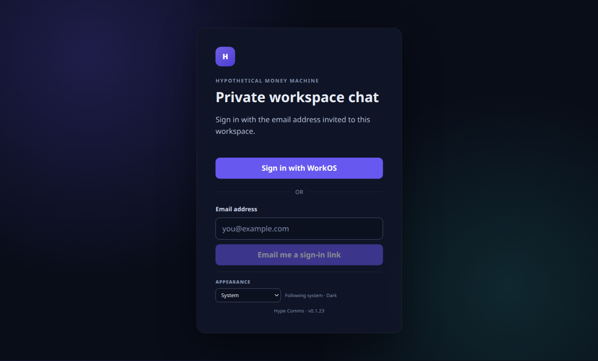

# WorkOS AuthKit

Hype Comms supports WorkOS AuthKit as an optional sign-in proof. AuthKit does not replace the
application's identity or session model: PostgreSQL still owns local UUIDs, invite admission,
workspace capacity, `hype_comms_session` cookies, device-session rotation, realtime scope, and immediate
local revocation. Existing magic links remain compatible during rollout.

## Request flow

1. Electron main creates a random desktop state and RFC 7636 verifier/challenge. It persists the
   state and verifier through Electron `safeStorage` before making a request.
2. `POST /v1/auth/desktop-authorizations` asks the server to begin AuthKit. The server asks WorkOS
   for a second PKCE transaction, hashes the provider state, and encrypts the provider verifier
   with AES-256-GCM for ten minutes.
3. Electron opens the credential-free WorkOS HTTPS authorization URL in the system browser.
4. WorkOS returns only to the server's fixed HTTPS callback. The server consumes provider state
   before exchanging the authorization code and validates the WorkOS access JWT with RS256,
   WorkOS JWKS, issuer, required claims, and this Application's exact `client_id`.
5. The verified WorkOS subject and email pass through local admission. A stable subject mapping or
   exact active-member email is accepted; otherwise an exact, pending, unexpired local invitation
   is activated transactionally under the 25-principal workspace cap. Impersonation and
   unverified email are rejected.
6. The server redirects to the callback scheme stored with the desktop transaction. The omitted
   or production variant uses
   `hype-comms://auth/callback?code=<hype-comms-handoff>&state=<desktop-state>`; the development
   variant uses `hype-comms-dev://auth/callback` with the same query shape. Provider codes, tokens,
   errors, and email never enter either URL.
7. Electron constant-time matches state, deletes its pending verifier before exchange, and sends
   the five-minute handoff plus verifier to `POST /v1/auth/exchange`. The server consumes it once
   and creates the existing 30-day rotating `hype_comms_session` device session.

An indeterminate handoff exchange is terminal and is never retried automatically. Starting again
creates completely new provider and desktop transactions.



## WorkOS dashboard setup

Create or select a WorkOS Application in the same environment as the API key, then configure:

- Redirect URI: `https://<public-api-host>/v1/auth/workos/callback`
- Webhook endpoint: `https://<public-api-host>/v1/auth/workos/webhook`
- Webhook event: `session.revoked`
- Application homepage and default sign-out redirect: a credential-free HTTPS page users can land
  on after the system browser ends the WorkOS session

For loopback development, the redirect URI is
`http://127.0.0.1:3000/v1/auth/workos/callback`. It must exactly match `HYPE_COMMS_PUBLIC_API_URL` plus the
callback path. WorkOS never redirects directly to the desktop scheme.

The app retains only the upstream WorkOS session ID needed to receive revocation. WorkOS access
and refresh tokens are discarded immediately after validation.

## Server configuration

Configure all four core values together:

```dotenv
WORKOS_API_KEY=sk_live_replace-me
WORKOS_CLIENT_ID=client_replace-me
WORKOS_REDIRECT_URI=https://chat-api.example.invalid/v1/auth/workos/callback
HYPE_COMMS_AUTH_ENCRYPTION_KEY=replace-with-43-character-unpadded-base64url
HYPE_COMMS_AUTHKIT_ADMISSION_ENABLED=false
```

Generate the encryption key without writing it to shell history or the repository:

```bash
openssl rand -base64 32 | tr '+/' '-_' | tr -d '='
```

Production admission also requires the endpoint signing secret and an exact reverse-proxy trust
boundary:

```dotenv
WORKOS_WEBHOOK_SECRET=replace-me
HYPE_COMMS_TRUSTED_PROXIES=172.20.0.0/16
```

JWT validation defaults to WorkOS's canonical `https://api.workos.com/` issuer. If the Application
uses a WorkOS custom authentication domain, configure the exact HTTPS URL exposed in the token's
`iss` claim, including its trailing slash when present:

```dotenv
WORKOS_JWT_ISSUER=https://auth.example.com
```

`WORKOS_API_KEY`, `HYPE_COMMS_AUTH_ENCRYPTION_KEY`, and `WORKOS_WEBHOOK_SECRET` are server secrets. Do not
put them in desktop build variables, renderer code, logs, screenshots, or client configuration.
Development/test accepts only a `sk_test_` key and loopback HTTP public origin. Production accepts
only a `sk_live_` key and requires HTTPS. `HYPE_COMMS_AUTHKIT_ADMISSION_ENABLED` defaults to `false`.
Signed webhooks and hourly active-session reconciliation remain live while the gate is false and
provider configuration is present. Database-only retention remains live even if provider secrets
are removed. Capability discovery reports AuthKit disabled and authorization, callback, and
handoff-exchange routes are unavailable. Production refuses to enable the gate without the
webhook secret and a nonempty, validated `HYPE_COMMS_TRUSTED_PROXIES` list.

## Admission and lifecycle behavior

- AuthKit is sign-in, not public signup. Create a local invitation first with the existing owner
  UI or `npm run invite --workspace @hype-comms/server -- --email member@example.com`.
- Matching uses the normalized, WorkOS-verified email exactly. A WorkOS subject becomes permanently
  bound to one local human account; a different subject cannot take it over later.
- A mapped subject whose verified email no longer matches the local account is denied rather than
  silently moving identity ownership.
- AuthKit sessions use the same local cookie, renewal lineage, session list, logout route,
  authenticated HTTP, realtime tickets, encrypted cache scope, and membership checks as magic
  links.
- A signed `session.revoked` webhook records the event idempotently and revokes every matching
  local device session. A revocation that arrives before desktop exchange also prevents that
  handoff from creating a session.
- At startup and hourly, the server obtains the complete active WorkOS session set for each mapped
  subject with an active local AuthKit session. It revokes exact snapshotted local rows that WorkOS
  no longer reports as active. A malformed, partial, cyclic, or unavailable provider response
  preserves that subject's local rows and retries on the next pass; a session created while a list
  is in flight is never judged against that older response. A definitive provider `404` for a
  previously verified subject is treated as a deleted user with no active sessions.
- Authorization starts are limited per source IP, and expired provider transactions and desktop
  handoffs are deleted at startup and hourly even when WorkOS credentials are absent. Processed
  webhook dedupe records are retained for 30 days. The upstream session link is cleared as soon as
  a local device session is revoked and by the same maintenance pass after local expiry.
- Local logout always revokes the Hype Comms device session first. For an AuthKit-created session,
  the desktop then opens WorkOS's validated session logout URL in the system browser on a
  best-effort basis. A browser-launch or upstream failure cannot undo local logout, and other
  WorkOS applications may remain signed in depending on their upstream session semantics.
- Because Hype Comms deliberately discards WorkOS refresh tokens, an individual local renewal does
  not synchronously evaluate the Application's WorkOS inactivity or maximum-lifetime policy.
  Signed revocation webhooks provide the immediate path, while active-session reconciliation
  recovers a missed webhook and bounds policy drift to the next successful hourly pass. A future
  upstream refresh-token implementation would be required for per-renewal WorkOS enforcement.

## Rolling deployment

Migration `0017_workos_authkit.sql` is additive: its WorkOS column on `device_sessions` is nullable,
and existing magic-link inserts and old servers continue to work. The admission gate is a required
cutover boundary because older servers do not receive or apply WorkOS session-revocation webhooks.
A safe rollout is:

1. Back up PostgreSQL. Configure the four provider values, webhook secret, and exact trusted proxy
   IP/CIDR, but leave `HYPE_COMMS_AUTHKIT_ADMISSION_ENABLED=false`.
2. Deploy migration `0017` and the AuthKit-capable server to every serving instance. With the gate
   still false, verify `/v1/auth/capabilities` reports `authKit: false` and the three admission
   routes are unavailable.
3. Verify signed `session.revoked` delivery in the WorkOS dashboard. Webhook processing,
   active-session reconciliation, and expired-state cleanup remain active while admission is
   gated off.
4. After every old server has been drained, set `HYPE_COMMS_AUTHKIT_ADMISSION_ENABLED=true` on every new
   server and verify capability discovery reports `authKit: true` consistently.
5. Ship the desktop update. New clients show **Sign in with WorkOS**; old clients continue using
   magic links. Keep magic-link delivery until the rollback window and desired migration period
   are complete.

## Rollback

Do not roll an AuthKit-enabled deployment directly back to an older server. The older server would
continue accepting an existing local cookie but could not honor a later WorkOS revocation. Instead:

1. On the current release, set `HYPE_COMMS_AUTHKIT_ADMISSION_ENABLED=false` everywhere. Fully drain every
   gate-enabled server, then verify every serving instance reports `authKit: false`. Keep the
   provider settings and signed webhook configured through the upstream revocation step.
2. Revoke the retained WorkOS sessions through the WorkOS dashboard or session-revocation API.
   Then disable the WorkOS webhook endpoint and drain any in-flight webhook request. An upstream
   failure must be reported and followed up, but cannot be allowed to block the local boundary in
   the next step.
3. Revoke every remaining AuthKit-created local device session transactionally. The same database
   transaction removes every provider-session link and purges all provider transactions, desktop
   handoffs, and webhook dedupe rows, so a pre-AuthKit binary cannot strand data it does not know
   how to maintain. The command requires the exact destructive-action confirmation and does not
   revoke magic-link sessions:

   ```bash
   npm run authkit:revoke-all --workspace @hype-comms/server -- \
     --confirm REVOKE-AUTHKIT-SESSIONS
   ```

   From the production Compose container, run the built command instead:

   ```bash
   docker compose exec server npm run authkit:revoke-all:dist -- \
     --confirm REVOKE-AUTHKIT-SESSIONS
   ```

4. Require the command to exit successfully with equal `found` and `revoked now` counts. Run it a
   second time and require the session counts, removed provider links, transactions, handoffs, and
   events all to be zero.
5. Only after the all-zero check may the application roll back to a pre-AuthKit server. Keep
   migration `0017` in place and keep magic-link delivery available.

Do not roll the database migration back while any AuthKit-created device session or retained WorkOS
state exists. A normal application rollback is not safe without the gate, upstream webhook drain,
and local revoke-and-purge sequence above. The local command intentionally requires only
`HYPE_COMMS_DATABASE_URL` (and the optional bounded `HYPE_COMMS_DATABASE_POOL_SIZE`), so provider credential loss
cannot block the emergency rollback boundary.

## Provider tests with WorkOS Emulate

Server AuthKit provider tests use [`@workos/emulate`](https://github.com/workos/emulate) as a local
WorkOS API. The helper at `apps/server/test/helpers/workos-emulate.ts` starts an in-process emulator
with a pinned `https://api.workos.com/` issuer, seeds users, and points the official
`@workos-inc/node` client (and `createWorkOSAuthKitIdentityProvider`) at that host via
`apiHostname` / `port` / `https: false`.

Covered against the emulator:

- authorization-code exchange with real RS256 access tokens and JWKS verification
- active-session listing after login
- deleted-user session reconciliation (`404` → empty active set)
- unverified email, invalid/reused codes, and PKCE verifier mismatches

Still unit-tested with fixtures (not the emulator):

- authorization/logout URL contract validation (production requires credential-free HTTPS on
  `api.workos.com`; the emulator serves `http://localhost`)
- pagination edge cases, impersonation signals, and secret-sanitized error classification
- webhook envelope validation (`event_*` ids and `context.client_id`), which the emulator currently
  shapes differently from production WorkOS
